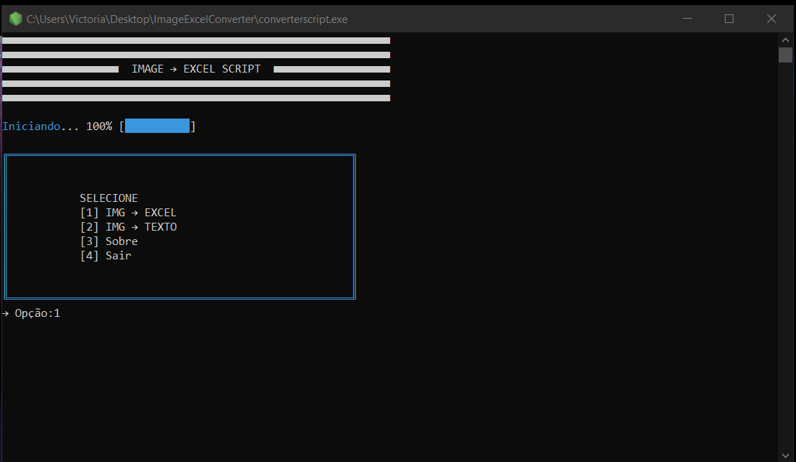
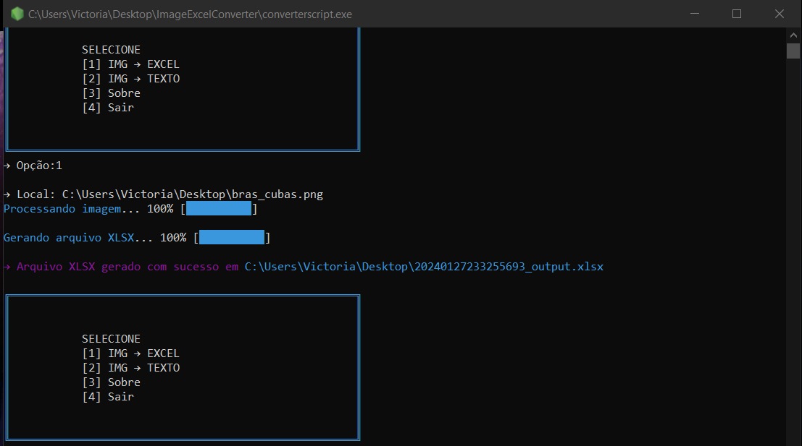
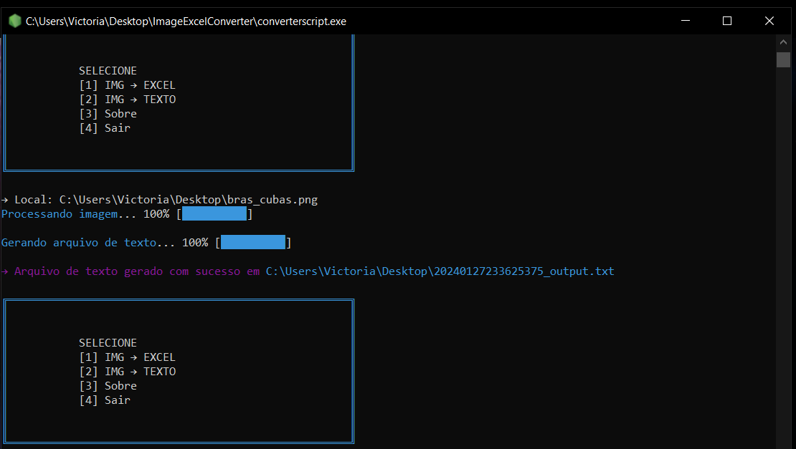

   
   

# ImageExcelConverter

Conversor de imagens para arquivo .txt/.xlsx

# Modo de Usar

Selecione uma opção e informe o caminho absoluto da imagem. O resultado do OCR estará na Área de Trabalho. 

# Amostra

</img>

## 01. IMG 🠖 XLSX

</img>

## 02. IMG 🠖 TXT

</img>

